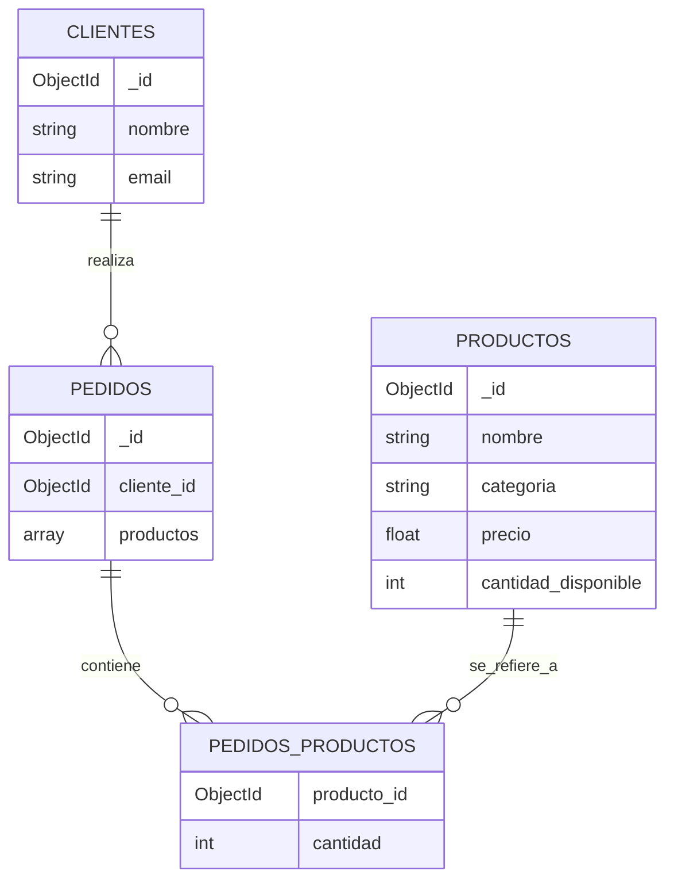

# PRIMER EJERCICIO

## PASOS

Ahora desarrollaremos una base de datos para un pequeño sistema de gestión de productos, clientes y pedidos.

### Diagrama



Este diagrama en **Mermaid** muestra cómo se relacionan las tres colecciones: **clientes**, **productos** y **pedidos**.

### Paso 1: Crear la estructura de las colecciones

#### 1. **Colección "productos":**

Cada producto en la tienda tendrá los siguientes campos:

```json
{
  "_id": ObjectId(),
  "nombre": "Camiseta",
  "categoria": "Ropa",
  "precio": 25.99,
  "cantidad_disponible": 100
}
```

#### 2. **Colección "clientes":**

Cada cliente tendrá los siguientes campos:

```json
{
  "_id": ObjectId(),
  "nombre": "Juan Pérez",
  "email": "juan.perez@example.com"
}
```

#### 3. **Colección "pedidos":**

Cada pedido estará relacionado con un cliente y contendrá una lista de productos con la cantidad comprada:

```json
{
  "_id": ObjectId(),
  "cliente_id": ObjectId("referencia_id_cliente"),
  "productos": [
    {
      "producto_id": ObjectId("referencia_id_producto"),
      "cantidad": 2
    }
  ]
}
```

### Paso 2: Insertar los 10 productos, 5 clientes y 3 pedidos

#### Insertar 10 productos:

```js
db.productos.insertMany([
  {
    nombre: "Camiseta",
    categoria: "Ropa",
    precio: 25.99,
    cantidad_disponible: 100,
  },
  {
    nombre: "Zapatos",
    categoria: "Calzado",
    precio: 59.99,
    cantidad_disponible: 50,
  },
  {
    nombre: "Pantalón",
    categoria: "Ropa",
    precio: 45.5,
    cantidad_disponible: 75,
  },
  {
    nombre: "Gorra",
    categoria: "Accesorios",
    precio: 15.99,
    cantidad_disponible: 30,
  },
  {
    nombre: "Bufanda",
    categoria: "Accesorios",
    precio: 12.5,
    cantidad_disponible: 40,
  },
  {
    nombre: "Reloj",
    categoria: "Joyería",
    precio: 150.0,
    cantidad_disponible: 20,
  },
  {
    nombre: "Sudadera",
    categoria: "Ropa",
    precio: 35.99,
    cantidad_disponible: 60,
  },
  {
    nombre: "Bolso",
    categoria: "Accesorios",
    precio: 89.99,
    cantidad_disponible: 25,
  },
  {
    nombre: "Correa",
    categoria: "Accesorios",
    precio: 29.99,
    cantidad_disponible: 100,
  },
  {
    nombre: "Anillo",
    categoria: "Joyería",
    precio: 199.99,
    cantidad_disponible: 15,
  },
]);
```

#### Insertar 5 clientes:

```js
db.clientes.insertMany([
  { nombre: "Juan Pérez", email: "juan.perez@example.com" },
  { nombre: "Ana Gómez", email: "ana.gomez@example.com" },
  { nombre: "Carlos Martínez", email: "carlos.martinez@example.com" },
  { nombre: "Laura López", email: "laura.lopez@example.com" },
  { nombre: "Pedro Torres", email: "pedro.torres@example.com" },
]);
```

#### Insertar 3 pedidos:

```js
db.pedidos.insertMany([
  {
    cliente_id: ObjectId("id_cliente_juan"),
    productos: [
      { producto_id: ObjectId("id_producto_camiseta"), cantidad: 2 },
      { producto_id: ObjectId("id_producto_gorra"), cantidad: 1 },
    ],
  },
  {
    cliente_id: ObjectId("id_cliente_ana"),
    productos: [
      { producto_id: ObjectId("id_producto_zapatos"), cantidad: 1 },
      { producto_id: ObjectId("id_producto_bolso"), cantidad: 1 },
    ],
  },
  {
    cliente_id: ObjectId("id_cliente_carlos"),
    productos: [{ producto_id: ObjectId("id_producto_reloj"), cantidad: 1 }],
  },
]);
```

### Paso 3: Consultas para gestionar pedidos

#### 1. **Obtener todos los pedidos realizados por un cliente específico**

La siguiente consulta obtiene todos los pedidos de un cliente, mostrando los productos, cantidad y total gastado en cada pedido.

```js
db.pedidos.aggregate([
  { $match: { cliente_id: ObjectId("id_cliente_juan") } },
  {
    $lookup: {
      from: "productos",
      localField: "productos.producto_id",
      foreignField: "_id",
      as: "detalle_productos",
    },
  },
  { $unwind: "$detalle_productos" },
  {
    $project: {
      producto: "$detalle_productos.nombre",
      cantidad: "$productos.cantidad",
      precio_unitario: "$detalle_productos.precio",
      total: {
        $multiply: ["$productos.cantidad", "$detalle_productos.precio"],
      },
    },
  },
]);
```

Esta consulta:

- Filtra por el `cliente_id` especificado.
- Usa `$lookup` para hacer un "join" entre la colección `pedidos` y `productos`.
- Calcula el total multiplicando la cantidad por el precio unitario.

#### 2. **Obtener todos los pedidos que incluyen un producto específico**

La siguiente consulta muestra todos los pedidos que incluyen un producto específico, junto con los clientes y la cantidad comprada.

```js
db.pedidos.aggregate([
  { $unwind: "$productos" },
  { $match: { "productos.producto_id": ObjectId("id_producto_camiseta") } },
  {
    $lookup: {
      from: "clientes",
      localField: "cliente_id",
      foreignField: "_id",
      as: "cliente",
    },
  },
  { $unwind: "$cliente" },
  {
    $project: {
      cliente: "$cliente.nombre",
      producto: "Camiseta",
      cantidad: "$productos.cantidad",
    },
  },
]);
```

Esta consulta:

- Descompone el array `productos` para trabajar con cada producto de forma individual.
- Filtra los pedidos que contienen el producto con el `producto_id` especificado.
- Usa `$lookup` para unir la colección `clientes` y mostrar el cliente que realizó el pedido.

### Paso 4: Optimización mediante índices

Para optimizar las consultas, puedes crear índices en los campos más frecuentemente utilizados en las búsquedas, como `cliente_id` en la colección `pedidos` y `producto_id` en los productos dentro de la misma colección.

```js
db.pedidos.createIndex({ cliente_id: 1 });
db.pedidos.createIndex({ "productos.producto_id": 1 });
```

### Resumen:

1. **Diseñamos 3 colecciones: `productos`, `clientes`, y `pedidos`**.
2. **Insertamos productos, clientes y pedidos**.
3. **Realizamos consultas usando `$lookup` y `$aggregate` para unir datos entre colecciones**.
4. **Optimizamos las consultas con índices**.
